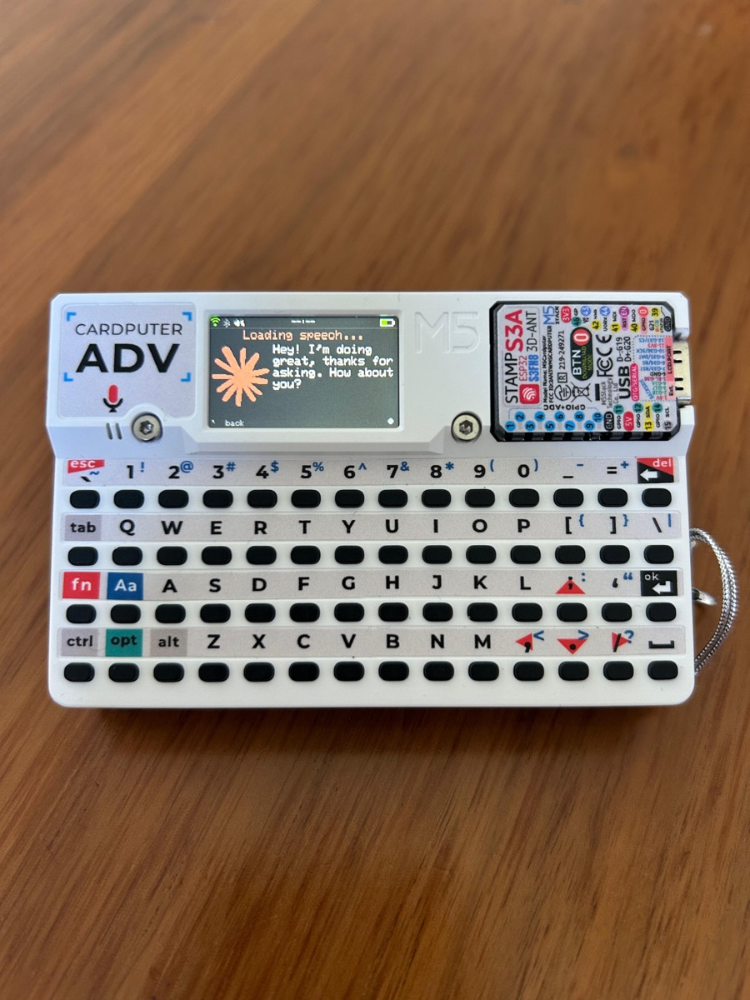
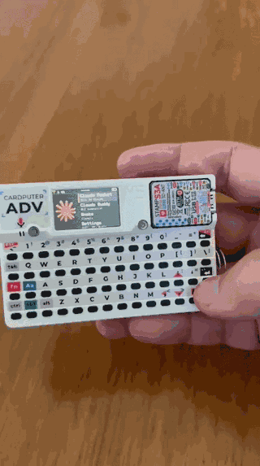

# Claude Pocket

A pocket-sized voice assistant for the **M5Stack Cardputer ADV**. Press OK,
speak, Claude answers out loud. Two API keys, no cloud middleware — the
device talks straight to the Anthropic and OpenAI APIs.

> Press OK → Whisper transcribes → **`claude-sonnet-4-6`** thinks →
> OpenAI TTS speaks back.

<p align="center">
  
  <br>
  
</p>

---

## From London → Tokyo Developer Conference

Built on the Cardputer ADV that Anthropic handed out at the **Developer
Conference in London**, in time for the next stop in **Tokyo**. If you
picked one up there, this firmware turns it into a working Claude voice
assistant in about ten minutes:

1. Flash the firmware (see [Build](#build) below).
2. Drop your `ANTHROPIC_API_KEY` and `OPENAI_API_KEY` into
   `firmware/config.h`.
3. Boot, join Wi-Fi from the on-device settings screen, press OK, and start
   talking.

---

## What it does

A Claude-styled launcher with four entries:

- **Claude Pocket** — the voice assistant. Press OK, speak, the device auto-
  detects when you're done (VAD), transcribes, thinks, and speaks back. The
  last 10 messages of conversation history persist across turns, so follow-up
  questions like "and how old is she?" resolve their own context.
- **Claude Buddy** — placeholder for the BLE companion port from the *Build
  with Claude* bundle (still a stub).
- **Snake** — with an Easy / Normal / Heavy difficulty menu.
- **Settings** — Wi-Fi scanner + password entry, Bluetooth toggle, speaker
  volume.

While Claude is busy, the Anthropic spark animates through every state —
*Understanding…* / *Thinking…* / *Loading speech…* / *Speaking…* — so you
always know what's happening. The whole UI uses Anthropic's brand palette
(Ivory background, Orange spark, Dark text).

## Hardware

- **M5Stack Cardputer ADV** (StampS3A · ESP32-S3FN8, **no PSRAM**)
- 1.14" ST7789V2 display · ES8311 audio codec · NS4150 amp + 1 W speaker
- Onboard MEMS mic · TCA8418 keyboard · 1750 mAh battery · 8 MB flash

Full pin map and codec wiring: [`docs/SPEC.md` §2](docs/SPEC.md).

## How the conversation works

- Press OK to start recording. The microphone runs at 16 kHz and writes
  samples straight to a LittleFS file (`/rec.pcm`) — see *Engineering notes*
  for why that matters on this chip.
- A VAD watches the mic level. After ~2.5 s of silence (with at least 1 s
  of speech captured) the recording closes automatically. A hard cap at
  **30 s** prevents runaway requests.
- The file is streamed in 1 KB chunks to Whisper. Whisper's transcript
  appears on the display under *Understanding…*.
- Claude streams its reply token-by-token, painted live on screen.
  `max_tokens` is set so replies stay around **30 s of spoken audio** —
  symmetric with the recording cap and small enough to fit the TTS body
  inside the 1.5 MB LittleFS partition.
- TTS audio downloads in full to `/tts.pcm` before playback starts. The
  speaker then reads off flash, slab by slab, so network jitter can never
  underrun the audio.

## Build

1. Install [PlatformIO Core](https://docs.platformio.org/en/latest/core/installation/methods/installer-script.html):
   ```bash
   python3 -m pip install --user platformio
   # or via Homebrew on macOS: brew install platformio
   ```
2. Copy the keys template and fill it in:
   ```bash
   cp firmware/config.example.h firmware/config.h
   # edit and add OPENAI_API_KEY + ANTHROPIC_API_KEY
   ```
   `config.h` is git-ignored, so keys never leave your machine.
3. Connect the Cardputer ADV via USB-C, then:
   ```bash
   cd firmware
   pio run -t upload          # compile + flash
   pio device monitor          # serial logs
   ```

If the device doesn't show up as a serial port, put it into download mode:
hold the `G0` button on the back, press and release `RST`, then release `G0`.

First-time build takes a few minutes — PlatformIO pulls the ESP32-S3
toolchain and the M5Unified / M5Cardputer / ArduinoJson libraries.

## Engineering notes

A few non-obvious choices that the codebase will look strange without:

- **Recording lives on flash, not RAM.** On the no-PSRAM StampS3A, after
  Wi-Fi + mbedTLS + M5GFX have taken their share of the 320 KB SRAM, the
  heap left over (~90 KB) is barely enough for a TLS handshake — and the
  Whisper upload itself sends a ~80 KB body. Keeping the PCM in RAM forced
  us to a 4 s recording cap. Writing it to LittleFS during capture and
  streaming it back to OpenAI in 1 KB chunks freed enough heap that the
  upload now drains cleanly.

- **TTS downloads first, then plays.** Early designs streamed the OpenAI TTS
  response straight to the speaker. mbedTLS on `arduino-esp32 2.x` has a
  habit of stalling at TLS-1.3 post-handshake records, which the speaker
  experiences as a sudden underrun mid-sentence. Buffering the full body to
  `/tts.pcm` before any playback decouples the two completely.

- **Audio playback uses a buffer pool.** `M5.Speaker.playRaw` stores a
  pointer to its sample data, not a copy. Reusing one feeder buffer
  produced a clearly audible doubling/echo. The fix: slice 16 KB of the
  mic recording buffer (idle during playback) into 16 rotating slabs so the
  speaker can drain old slabs while we prepare new ones.

- **Conversation history is JSON, capped at 10 messages.** Each Pocket
  session starts fresh; within a session, every user + assistant turn is
  appended to a small history array that Claude sees on the next request.
  10 messages × ~200 tokens each is well within both Claude's context
  budget and our SRAM.

- **A robust HTTP body reader.** The Whisper and TTS readers treat
  `available() == 0` as transient, not as EOF — they keep reading until
  either Content-Length is reached or the socket is actually closed. The
  obvious version of this loop quietly truncated bodies on every TLS
  record gap.

The full debug history (mbedTLS stalls, audio doubling, flash-vs-RAM
trade-offs) lives in the commit log — it's the more interesting half of
this project.

## Acknowledgements

Big thank-you to **[M5Stack](https://m5stack.com)** for the Cardputer ADV. A
keyboard, ST7789V2 display, ES8311 codec, NS4150 amp, MEMS mic and 1750 mAh
battery in something that fits in your jacket pocket — and at a price point
that makes "let me try Claude on hardware" a one-evening decision instead of
a multi-month one. Couldn't have built this on anything cheaper.

And thank-you to **Anthropic** for handing one of these out at the **London
Developer Conference**, alongside the Claude Buddy bundle. The original
"Build with Claude" examples were the starting point for the firmware here;
Claude Pocket is the voice-assistant side built on top.

Uses the [Anthropic API](https://docs.anthropic.com/) (`claude-sonnet-4-6`)
and OpenAI Whisper + `gpt-4o-mini-tts`.

## License

MIT — see [`LICENSE`](LICENSE). Not affiliated with or endorsed by Anthropic
or M5Stack; "Claude" and the Claude mark are trademarks of Anthropic.
